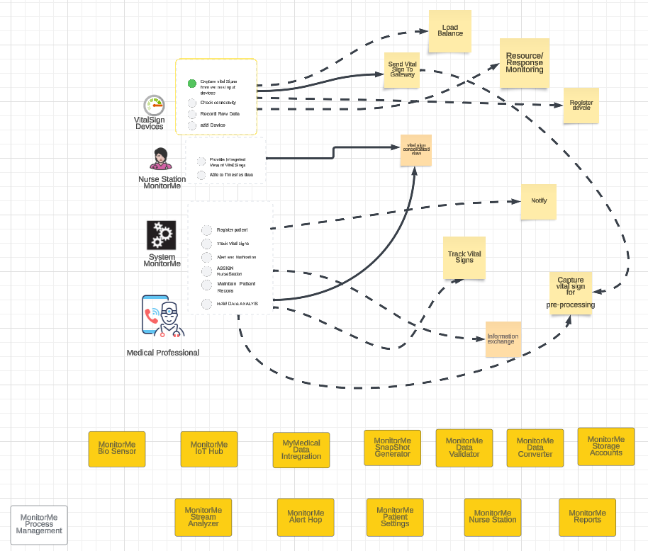

[> Home](../README.md)  |  [> Architecture Analysis Dir](README.md) |  [< Prev](3.2.ConstraintsAndAssumptions.md)  |  [Next >](3.4.KeyArchitectureCharacteristics.md)

---

## 3.3 Actors, Actions, and Components

The Actors on the system (typically the human users but can also include other systems) and the actions they take help to form the key scenarios, or flows, of the system. The following identifies the significant actors, actions and key scenarios that will inform the architecture of the MonitorMe system.

## Actors, Actions, & Components

The following are the identified actors, actions, and & components of MonitorMe, note we included the first draft and the final version:

**First Draft**

**Final Version**

## Architectural Components

The following are the most architecturally significant scenarios/flows, derived from the Actors and Actions above, which will shape the architecture of the MonitorMe system.

### 01  Onboard Patient to MonitorMe

A patient is connected to all the patient-monitoring devices to collect the patient's vital signs.

### 02 Share Patient's Vital Signs Data with MonitorMe and Nurse's station

The patient's vital signs data is streamed to MonitorMe to be analyzed and then send to a consolidated monitoring screen per nurse station.

### 03 Medical Professionals receive alert push notifications

If any of vital sign device (or software) fails, MonitorMe must still function and sent alert push notifications to a StayHealthy mobile app as well as to the consolidated monitoring screen in each nurses station.

### 04 Medical Professionals can generate holistic snapshots

Medical professionals can generate holistic snapshots from a patient's consolidated vital signs at any time and then upload the patient's holistic snapshot to MyMedicalData.

---
[> Home](../README.md)  |  [> Architecture Analysis Dir](README.md) |  [< Prev](3.1.ConstraintsAndAssumptions.md)  |  [Next >](3.3.KeyArchitectureCharacteristics.md)
